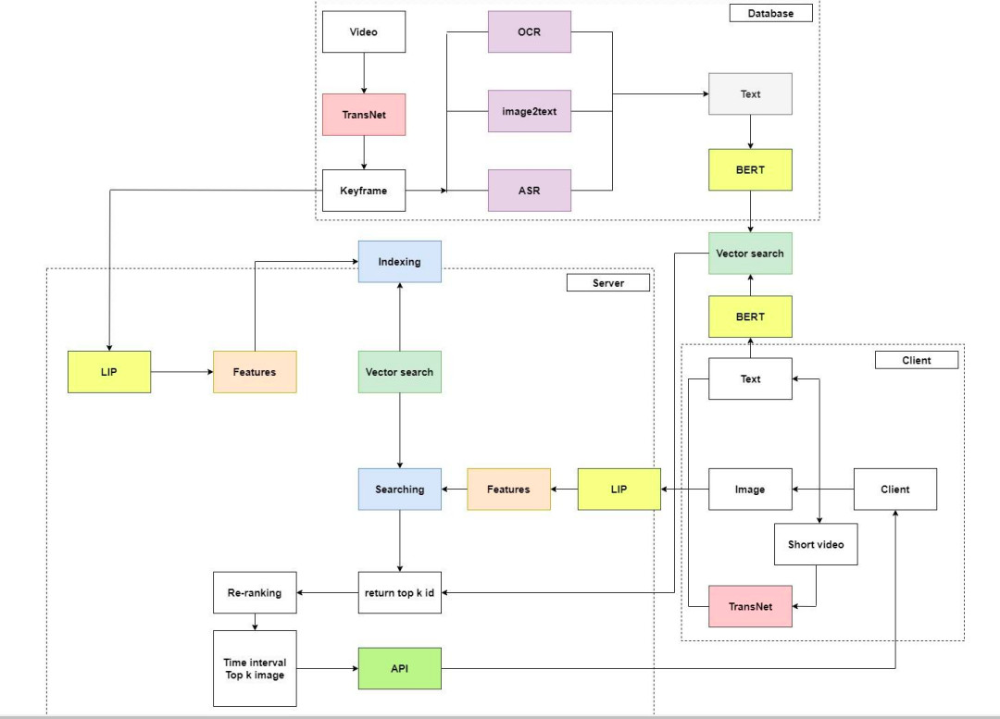
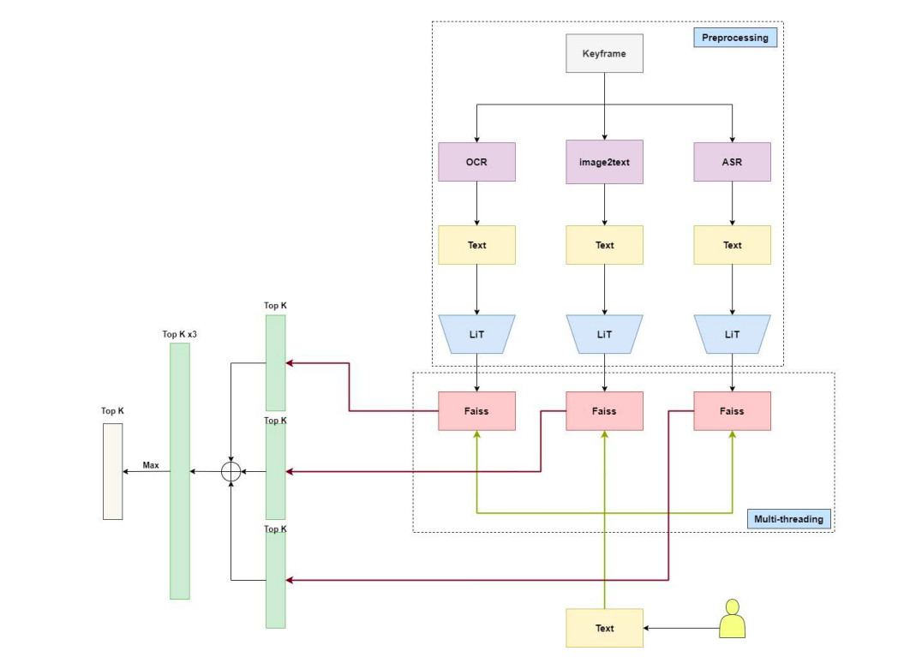
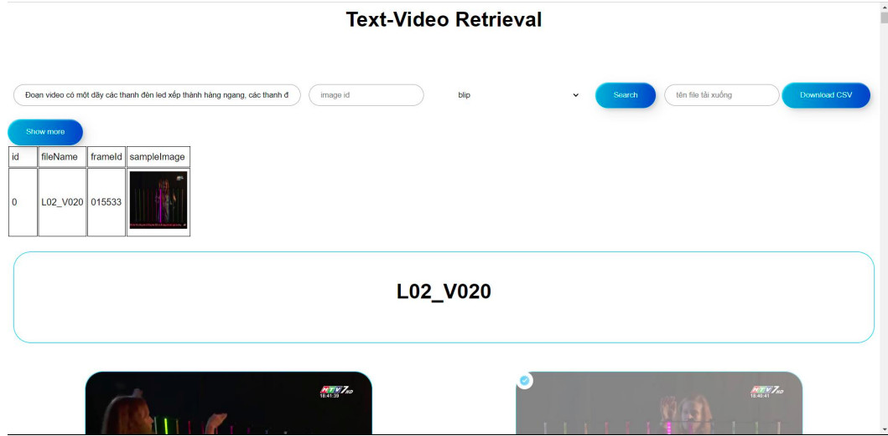

<!-- PROJECT LOGO -->
<br />
<div align="center">
    <h3>Hi, Team UTE-AI Fluc, author of this repository 🚀</h3>


<h1 align="center">AIC 2023</h1>

</div>

## Solution



## User Interface Designing



## Tree folder

```
|---data
|   |--news_aic2023
|   │   |--Keyframes_L01
|   |   |       |--L01_V001
|   |   |               |-- *.jpg
|   |   |       |--L01_V002
|   │   |--Keyframes_L02
|   
|   |--videos
|       |--Keyframes_L01
|           |--*.mp4
|
|---dicts
|   |--data_ocr
|           |--Keyframes_L01
|                   |--Keyframes_L01.txt
|                   |--L01_V00*.txt
|           |--Keyframes_L02
|   |--info_ocr.txt
|   |--*.json
|
|---model
|   |--ocr_features
|       |--*.npy
|
|   |--asr_features
|
|   |--img_cap
|
|   |--*.bin
|
|--utils
|
|---README.md
```


## References
- https://www.kaggle.com/nhnnguynngc/datasets
- https://github.com/AIVIETNAMResearch/Video-Text-Retrieval
